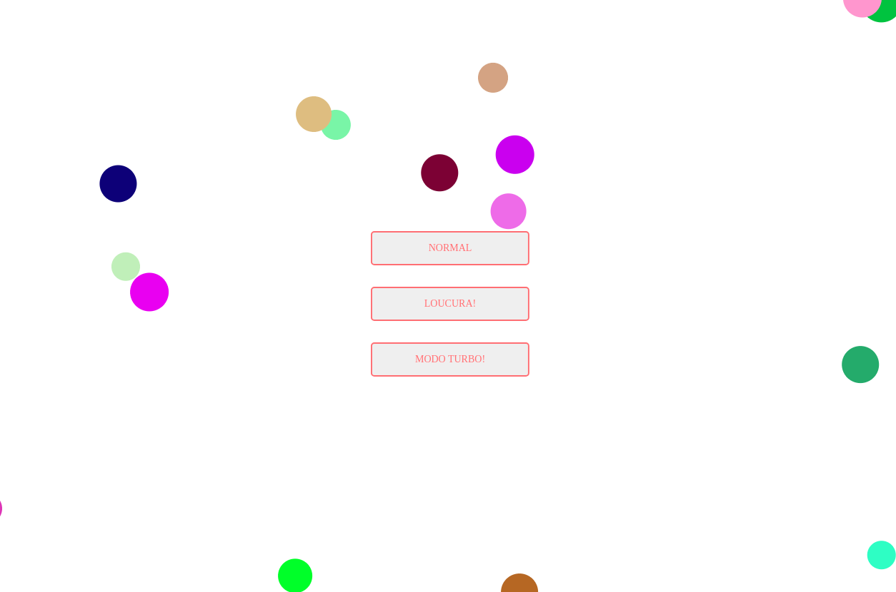

<h1 align="center">Turbo balls</h1>

<h2 align="center">
  <a href="http://turbo-balls.surge.sh/">🖥 Preview</a>
</h2>

## 

---

## 🚀 Challenge

[Link da Challenge 10 da FW7](https://github.com/fw7-solucoes/challenges/tree/master/challenge-10).

---

## 📃 Sobre

Nesse desafio o objetivo era criar uma interface onde o usuário possa clicar em um botão e deve ser gerado uma bolinha com uma cor, tamanho, velocidade e direção aleatória, e deve ser lançada na interface, conforme a bolinha bater em cada canto da interface ela deve serguir os princípios da física e mudar sua direção.

 

---

## ✅ Objetivos

- Deve ser possível gerar uma bolinha.
- Deve ser possível gerar uma cor aleatória.
- Deve ser possível gerar um tamanho aleatório.
- Deve ser possível gerar uma velocidade aleatória.
- Deve ser possível gerar uma direção aleatória.
- Deve seguir os princípios de colisão da física.

Você pode ver o resultado final aqui: [Preview](http://turbo-balls.surge.sh/).

by [Anderson Espindola](https://www.linkedin.com/in/anderson-espindola/)
